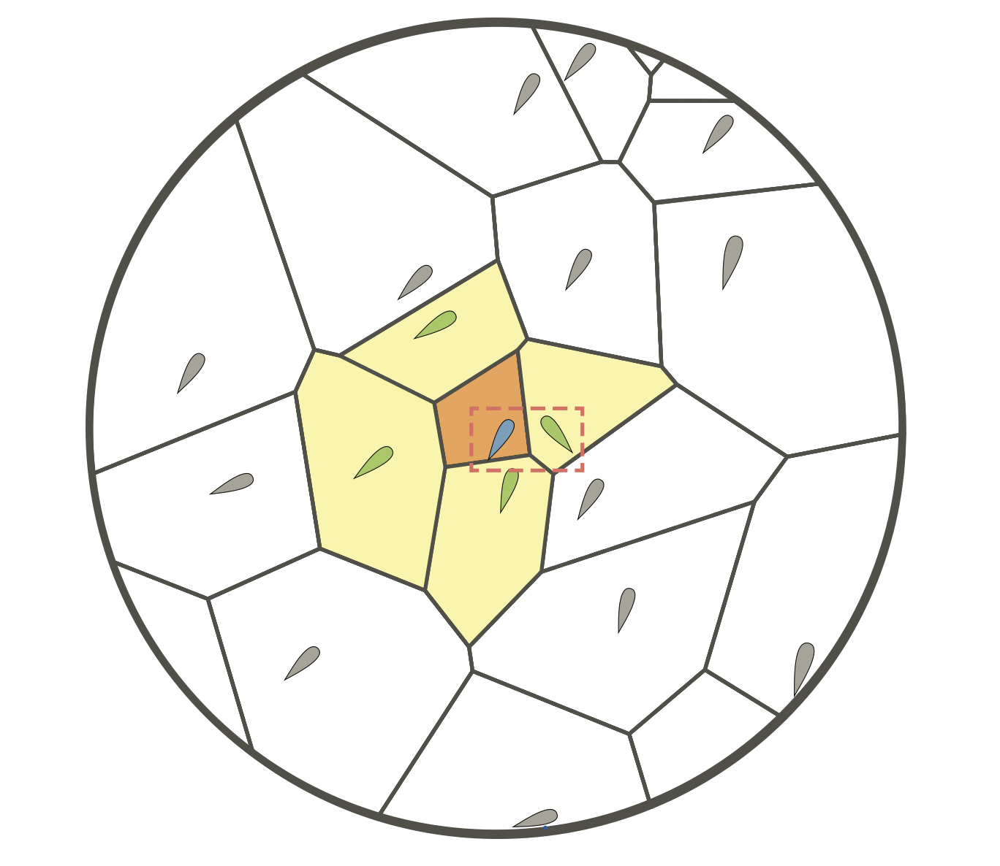
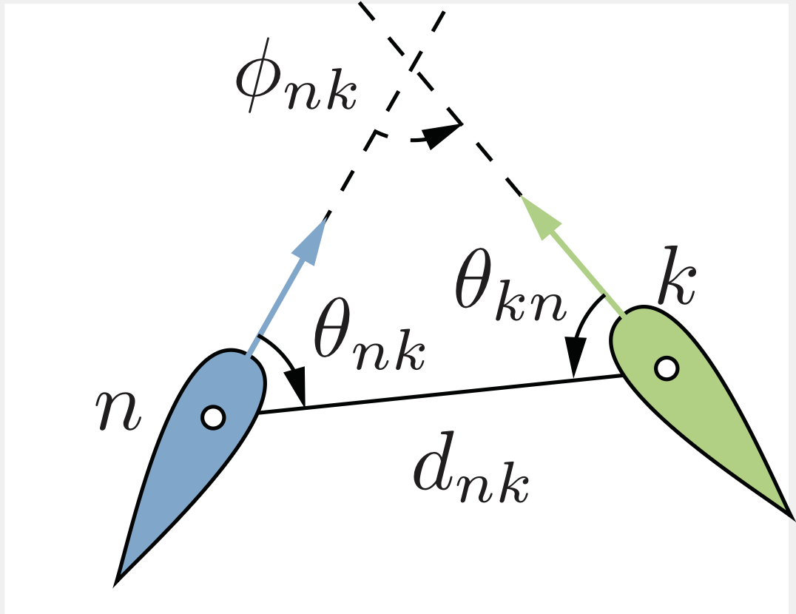
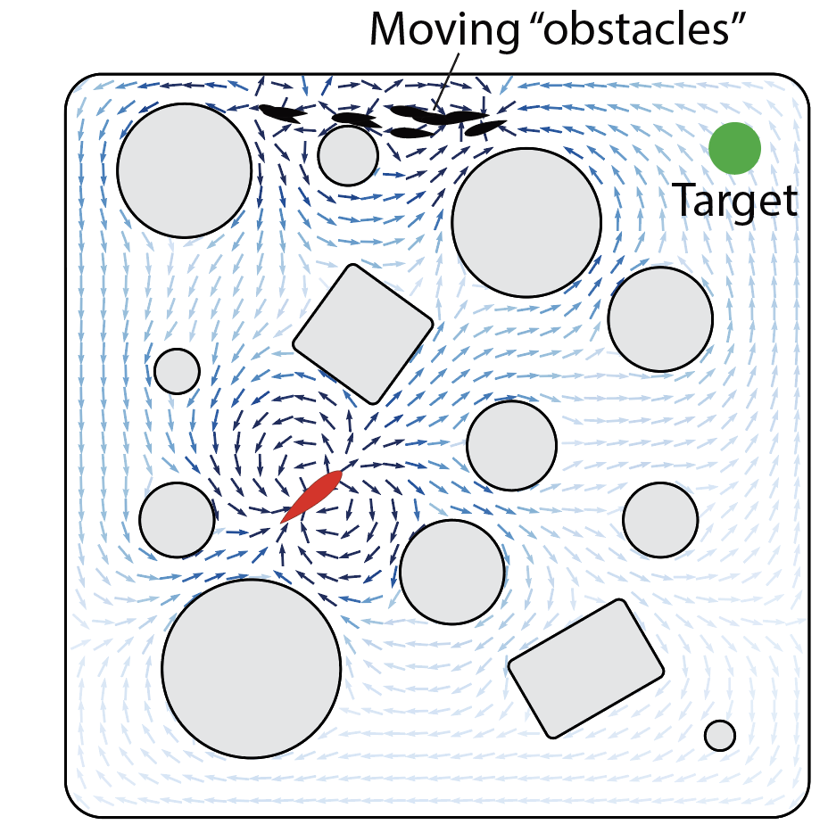

# CSCI-653 High Performance Computing — Fish Schooling in Complex Geometries

**Participants:** Hao Cheng

---

## 0. Problem Description

Fish typically congregate into cohesive groups to explore and navigate environments safely and efficiently, exhibiting collective phases such as polarized schooling, milling [@gautrais2012deciphering], turning [@filella2018model], and swarming. Most existing models focus on unbounded domains. However, many natural environments contain complex confinement, such as undersea tunnels and caves. Understanding how fish behave under geometric constraints requires new simulation frameworks.

In this project, we use high-order boundary integral equations to impose non-penetration boundary conditions for potential dipole flow fields and investigate fish-schooling dynamics inside a bi-chamber geometry consisting of two chambers connected by a narrow channel. We examine population oscillations between chambers, the influence of group size, geometric effects on transitions, and the interplay between hydrodynamic interactions and confinement.

---

## 1. Simulation Methods

Fish are modeled as active particles. Filella *et al.* [@filella2018model] demonstrated how hydrodynamic interactions and behavioral rules generate phases such as collective turning and milling. Gautrais *et al.* [@gautrais2012deciphering] extracted interaction rules directly from experimental data, showing how positional and orientational cues determine turning behavior. Calovi *et al.* [@Cavaiola2021] studied responses to external perturbations, finding sensitivity peaks near transitions between schooling and milling. Huang *et al.* [@Huang2017] showed that confinement generates new behaviors such as double milling and wall-following. Tsang and Kanso [@Tsang2015] investigated confined microswimmers and demonstrated transitions between chaotic swirling, stable circulation, and boundary aggregation.

We use the Euler–Maruyama method to simulate the stochastic differential equations. Since noise is present in the turning dynamics, we run multiple Monte Carlo (MC) simulations distributed over OpenMPI on USC CARC. Data analysis includes spatial probability density heat maps, velocity-correlation statistics, and flow visualization. All existing and newly developed codes are written in Python and MATLAB

---
## 2. Mathematical Modelling

Let each fish $n$ be at position:

$$
\mathbf{r}_n = (x_n, y_n), \qquad
\mathbf{p}_n = (\cos\theta_n, \sin\theta_n),
$$

and swim at speed $U = 0.2\ \mathrm{m/s}$ relative to the flow.

---

### Equations of motion

#### Translational dynamics
$$
\dot{\mathbf{r}}_n = U\mathbf{p}_n + \mathbf{U}_n.
$$
#### Rotational dynamics

$$
\mathrm{d}\theta_n =
\left[
(\mathbf{p}_n \cdot \nabla)\mathbf{U}_n \cdot \mathbf{p}_n^\perp
+
k_w \frac{\mathrm{sgn}(\phi_{wn})}{d_{wn}}
\right]\mathrm{d}t
+
\left\langle
k_p d_{nk}\sin\theta_{nk}
+
k_v\sin\phi_{nk}
\right\rangle \mathrm{d}t
+
\sigma\mathrm{d}W.
$$

---
The prescribed system incorporates
**Hydrodynamic disturbance**

$$
\mathbf{U}_n = (\mathbf{u} + \mathbf{u}_{\mathrm{BEM}})\big|_{\mathbf{r}_n}.
$$

**Wiener process**

$$
\mathrm{d}W = \sqrt{\mathrm{d}t}\mathcal{N}(0,1).
$$

**Voronoi-based behavioral operator**

  
  

 

$$ 
\langle \circ \rangle = \frac{ \sum_{j \in \mathcal{V}_n} \circ  (1+\cos\theta_{nk}) }{ \sum_{j \in \mathcal{V}_n} (1+\cos\theta_{nk}) }
$$

- $\theta_{nk} = \arctan2 \left(y_k-y_n,x_k-x_n \right)-\theta_n$
- $\phi_{nk} = \theta_k - \theta_n$
- $d_{nk} = \lVert \mathbf{r}_n - \mathbf{r}_k \rVert$

---

**Hydrodynamic Interactions**

The disturbance induced by fish $k$ on fish $n$ is modeled as:

$$
\mathbf{u}_{kn} = \frac{k_f}{\pi}\frac{\mathbf{p}_n \sin(2\theta_{kn}) + \mathbf{p}_n^\perp \cos(2\theta_{kn})}{d_{nk}^2}
$$

Here $k_f = S v$, where $S = \pi l^2 / 4$ is the fish’s cross-sectional area and $l$ is body length.

**Complex representation of dipoles**

Using complex notation $$z_n = x_n + i y_n$$:

$$
F(z)
= -\sum_{n=1}^N
\frac{k_f e^{i\theta_n}}{\pi (z - z_n)},
\qquad
w(z)
= \frac{\partial F}{\partial z}
= \sum_{n=1}^N
\frac{k_f e^{i\theta_n}}{\pi (z - z_n)^2}.
$$

To avoid singularities when swimmers approach each other, we use the regularized form:

$$
w^\delta(z)
= \sum_{n=1}^N
\frac{k_f e^{i\theta_n}}{
\pi\big[(z - z_n)^2 + \delta^2\big]
}.
$$

**Boundary element method**

A common method for addressing the Laplace boundary value problem (BVP) is to transform
the BVP into a boundary integral equation, thereby solving it as a linear system.
The boundary integral equation for the two-dimensional Laplace equation is written as follows:

$$
\frac{\partial}{\partial \mathbf{n}_s} S\[ \sigma \](s^\pm) = \mp \frac{1}{2}\,\sigma(s) + \int_{\partial \Omega} \sigma(t)\frac{\partial}{\partial \mathbf{n}_s} \Phi(s,t) dt
$$
## 3. Results

  

 

These results reveal how confinement and flow-mediated interactions shape collective behavior in complex environments.

